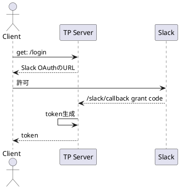

# ログイン系の設計

## Appについて

- SlackのOAuthでログインを行う
- TeamPlanetのID, passwordはつくらない
- jwtのペイロードにuserId, teamIdを与える
- https://api.slack.com/authentication/oauth-v2

- slackのaccessToken, refreshTokenはDBで管理している
- slackとtpのトークンの期限は別
- slackのトークンの期限は？
- TODO: rotateが上手く動作していない
- ライブラリ的には@slack/oauthのInstallProviderのauthorizeでtoken rotateをやっている
- authorizeはイベント発生時に呼び出される
- 現在は独自実装のauthorizerを用いてそこでrotate処理をやっていないのが問題
  - 独自実装にする必要がなければデフォルトでやる
  - 独自実装にする必要があればrotate処理を加える
  - https://slack.dev/bolt-js/ja-jp/concepts#authorization
- https://github.com/slackapi/bolt-js/blob/main/docs/_advanced/ja_token_rotation.md
- https://github.com/slackapi/bolt-js/blob/main/docs/_advanced/token_rotation.md
- https://api.slack.com/authentication/rotation
- [OAuthのライブラリ実装](https://github.com/slackapi/node-slack-sdk/blob/8e7310640640f08ed31221d87ad6a4acf81c51e9/packages/oauth/src/index.ts#L135-L238)
- installationStore.fetchInstallation
- https://github.com/slackapi/bolt-js/issues/1199 

- 

## 管理画面について

### 要求

- 企業単位で契約を行う
- 契約者はslackのworkspaceとの連携の管理を行う
- アプリと同様にslackのユーザー管理に依存した場合に、slackとの連携解除後に請求等で困る

### 仕様

- Slackと独立したID, passwordで管理する
- 監理者ユーザーがアプリを使うときはSlackユーザーとしてログインする
